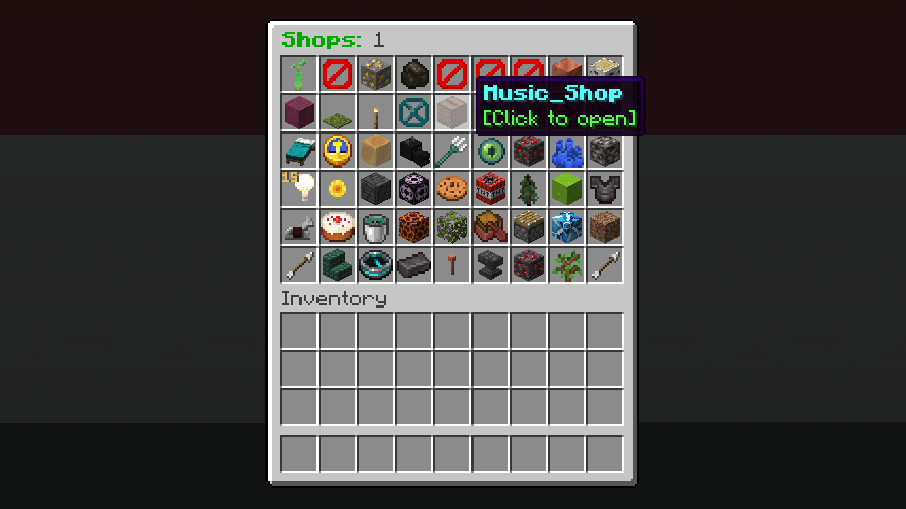
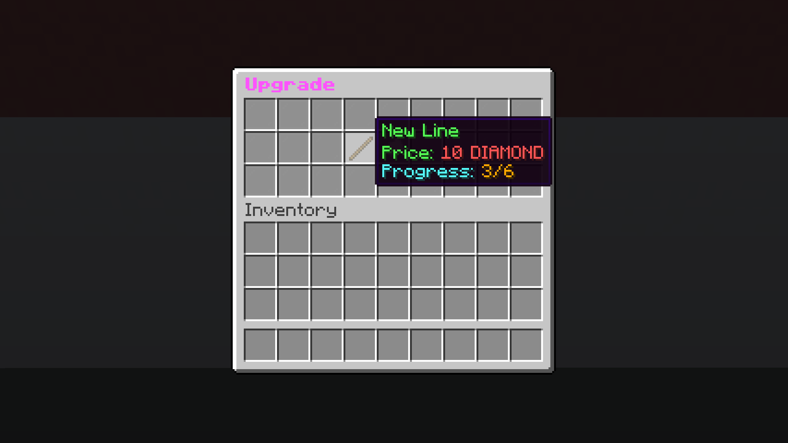
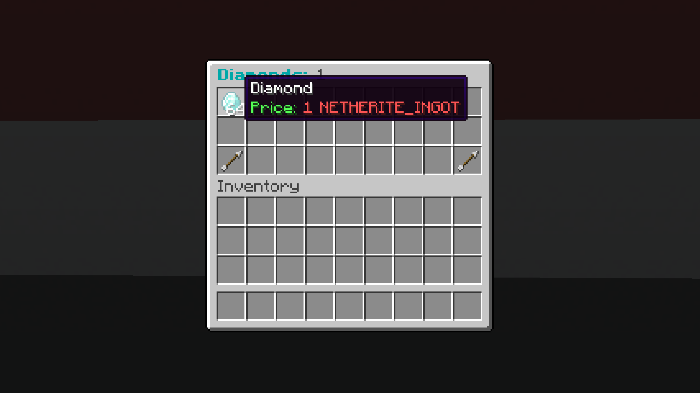
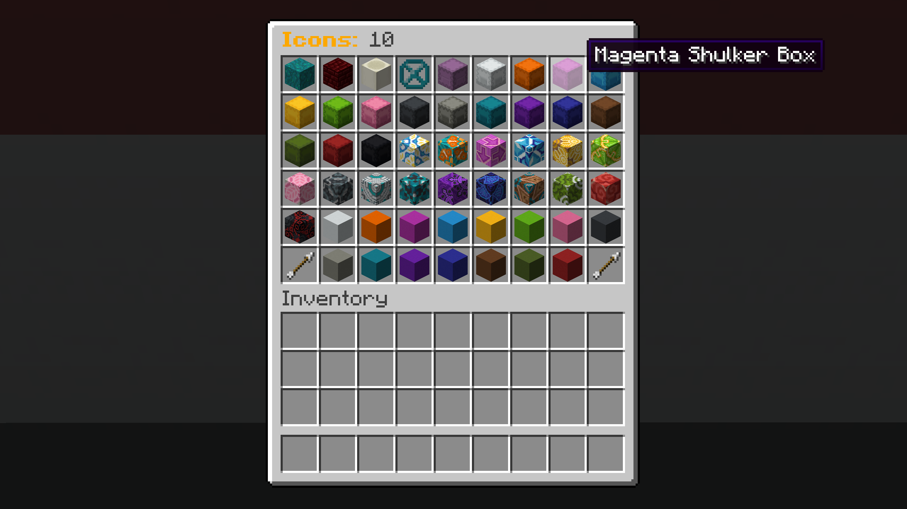

# LiteShops

### _Easy to use plugin, that adds shops to your server_

---

## Releases

* liteShops-ver-paper - only for paper and paper forks
* liteShops-ver-spigot - for all spigot forks (most server cores)

---

## Commands

### Shops

* `/shop create <name>` **command to create a shop**
* `/shop open` **command to open shop menu (click on the icon to open shop)**
* `/shop upgrade <shopName>` **command to open shop upgrade menu (Stick - `new Line`, Paper - `new Page`)**
* `/shop coffer <shopName>` **command to open shop storage where sales revenue is located**

### Edit

* `/shop edit <shopName> name <newName>` **command to change shop name**
* `/shop edit <shopName> price <page> <index> <material> <amount>` **command to set the price for an item in the shop**
* `/shop edit <shopName> icon` **command to open icon menu**
* `/shop edit <shopName> color` **command to set the color of your shop**

### Infinite Shops

* `/shop infinite buy create <name>` **command to create infinite buy shop (can be used only by an operator)**
* `/shop infinite sell create <name>` **command to create infinite sell shop (can be used only by an operator)**
* `/shop infinite buy open` **command to open infinite buy shop menu**
* `/shop infinite sell open` **command to open infinite sell shop menu**

---

## Permissions

### Available for everyone by default

* `liteshops.command.create` **permission to create a shop**
* `liteshops.command.open` **permission to open shops**
* `liteshops.command.edit` **permission to edit shops**
* `liteshops.command.coffer` **permission to open shop coffer**
* `liteshops.infinite.command.open.buy` **permission to open infinite buy shops**
* `liteshops.infinite.command.open.sell` **permission to  open infinite sell shops**

### Available only for operators by default

* `liteshops.infinite.command.create.buy` **permission to create an infinite buy shop**
* `liteshops.infinite.command.create.sell` **permission to create an infinite sell shop**

---

## Notes

* If you are the owner of a shop that you open through the menu, it will open in edit mode, so you can pick up things from there or add them for free
* You can also use `permission.*` to get all children of that permission
For example `liteshops.infinite.command.create.*` will give 
`liteshops.infinite.command.create.buy` and `liteshops.infinite.command.create.sell` permissions